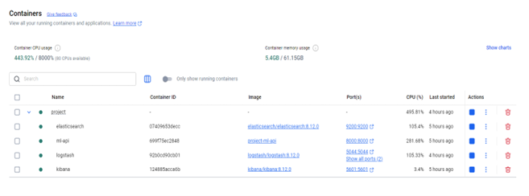

# 🛡️ Anomalyzer — система обнаружения аномалий в сетевом трафике с использованием ИИ

**Anomalyzer** — это полностью открытая система для выявления сетевых аномалий на основе нейросети (MLP) с интеграцией в стек ELK. Проект был разработан и защищён как выпускная квалификационная работа в июне 2025 года, а теперь опубликован для сообщества под лицензией GPLv3.

---

## 📖 Общее описание

Anomalyzer классифицирует сетевые потоки на основе 78 числовых признаков, извлечённых из датасета CICIDS2017. Он обеспечивает прогнозирование в реальном времени с помощью предварительно обученной модели MLP (в формате ONNX), API на FastAPI и визуализации через Kibana.

---

## 🎯 Цели проекта

- ✅ Обучить устойчивую нейросеть для классификации сетевого трафика
- ✅ Экспортировать модель в формат ONNX для продакшена
- ✅ Развернуть REST API на FastAPI для обработки запросов
- ✅ Интегрировать с Logstash, читающим структурированные CSV
- ✅ Визуализировать результат через Kibana
- ✅ Обеспечить переносимость через Docker Compose

---

## 🏗️ Архитектура проекта



---

## 🔬 Используемые технологии

- **PyTorch** — обучение нейросети
- **ONNX** — продакшен-инференс
- **FastAPI** — REST API
- **Scikit-learn** — LabelEncoder, SMOTE, масштабирование
- **Elasticsearch** — хранение предсказаний
- **Logstash** — приём и преобразование потока данных
- **Kibana** — мониторинг и аналитика
- **Docker / Compose** — контейнеризация и запуск

---

## 📦 Структура репозитория

```bash
Anomalyzer/
├── model-training/       # Код обучения, API и тестирования
├── pretrained-models/    # ONNX-модель, scaler, список классов
├── runtime-system/       # docker-compose, logstash, ml-api
├── docs/                 # Схемы, графики, скриншоты
└── README.md             # Это описание
```

---

## 🚀 Быстрый старт

> Требуется: установленный Docker и Docker Compose

```bash
cd runtime-system
cp .env.example .env
docker-compose up --build
```

- `ml-api`: http://localhost:8000/predict
- `logstash` считывает `.csv` из `logstash/data/*.csv`
- `kibana`: http://localhost:5601

---

## 🧪 Пример запроса к API

```http
POST /predict
Content-Type: application/json

{
  "features": [123, 6, 200000, 10, 8, 500, 400, ..., 0]
}
```

Ответ:
```json
{
  "predicted_class": "BENIGN",
  "probabilities": {
    "BENIGN": 0.992,
    "DDoS": 0.003,
    ...
  }
}
```

---

## 📊 Метрики модели

| Метрика     | Значение |
|-------------|----------|
| Accuracy    | 0.987    |
| F1-Score    | 0.986    |
| ROC-AUC     | 0.993    |
| Precision   | 0.988    |
| Recall      | 0.984    |

---

## 🧬 Об источнике данных

Проект использует датасет **CICIDS2017**, предоставленный Канадским институтом кибербезопасности:

🔗 [https://www.unb.ca/cic/datasets/ids-2017.html](https://www.unb.ca/cic/datasets/ids-2017.html)

Все права и исходная разметка принадлежат Университету Нью-Брансуика.

---

## 👨‍💻 Автор

**Руслан Покатилов**  
Специальность: 10.02.05 — Обеспечение информационной безопасности  
Красный диплом, защита в июне 2025 года  

---

## ⚖️ Лицензия

Проект распространяется по лицензии **GNU General Public License v3.0**.

> Вы можете использовать, изменять и распространять проект при соблюдении условий лицензии GPLv3  
> Подробнее: https://www.gnu.org/licenses/gpl-3.0.html
